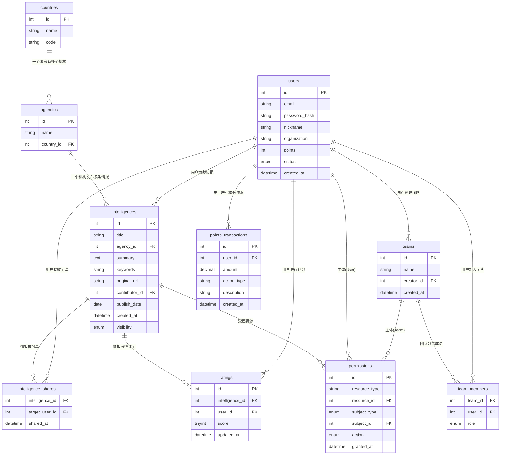

## 1. 情报组织机构
### 国家表 `countries`

| 字段名 | 类型 | 说明 |
| --- | --- | --- |
| id | INT (PK) | 自增 ID |
| name | VARCHAR | 国家名称 |
| code | VARCHAR | ISO 国家代码 (如：CN, US) |

### 机构表 `agencies`
| 字段名 | 类型 | 说明 |
| --- | --- | --- |
| id | INT (PK) | 自增 ID |
| name | VARCHAR | 机构名称 |
| country_id | INT (FK) | 关联 `countries.id` |

## 2. 用户与团队
### 用户表 `users`
| 字段名 | 类型 | 说明 |
| --- | --- | --- |
| id | INT (PK) | 自增 ID |
| email | VARCHAR | 邮箱（唯一） |
| password_hash | VARCHAR | 密码哈希 |
| nickname | VARCHAR | 昵称 |
| organization | VARCHAR | 所属组织 |
| points | INT | 剩余积分（默认 0） |
| status | ENUM | 状态：`active`, `disabled`, etc |
| created_at | DATETIME | 注册时间 |

### 团队表 `teams`
| 字段名 | 类型 | 说明 |
| --- | --- | --- |
| id | INT (PK) | 自增 ID |
| name | VARCHAR | 团队名称 |
| creator_id | INT (FK) | 创建者，关联 `users.id` |
| created_at | DATETIME | 创建时间 |

### 团队成员关系表 `team_members`
| 字段名 | 类型 | 说明 |
| --- | --- | --- |
| team_id | INT (FK) | 关联 `teams.id` |
| user_id | INT (FK) | 关联 `users.id` |
| role | ENUM | 角色：`admin` (管理员), `member` (成员) |

## 3. 情报
### 情报主表 `intelligences`
| 字段名 | 类型 | 说明 |
| --- | --- | --- |
| id | INT (PK) | 自增 ID |
| title | VARCHAR | 标题 |
| agency_id | INT (FK) | 来源机构，关联 `agencies.id` |
| summary | TEXT | 简介 |
| keywords | VARCHAR | 关键词，逗号分隔或者json |
| original_url | VARCHAR | 原始链接 |
| contributor_id | INT (FK) | 贡献者，关联 `users.id` |
| publish_date | DATE | 情报原始发布日期 |
| created_at | DATETIME | 入库时间 |
| visibility | ENUM | 可见性：`acl`, `public` |

### 情报共享表 `intelligence_shares`
| 字段名 | 类型 | 说明 |
| :--- | :--- | :--- |
| intelligence_id | INT (FK) | 关联 `intelligences.id` |
| target_user_id | INT (FK) | 被分享者 ID |
| shared_at | DATETIME | 分享时间 |

### 权限管理ACL `permissions`
| 字段名 | 类型 | 说明 |
| --- | --- | --- |
| id | INT (PK) | 自增 ID |
| resource_type | VARCHAR | 资源类型，如情报 `intelligence` |
| resource_id | INT | 对应资源的 ID, 如情报ID |
| subject_type | ENUM | 主体类型：`user`, `team` |
| subject_id | INT | 主体 ID（用户 ID 或团队 ID） |
| action | ENUM | 权限级别：`view` (查看), `edit` (编辑), `admin` (完全控制) |
| granted_at | DATETIME | 授权时间 |

## 4. 评分
记录不同用户对不同情报的评分，便于计算平均分，用户也可后期修改评分。

### 评分表 `ratings`
| 字段名 | 类型 | 说明 |
| --- | --- | --- |
| id | INT (PK) | 自增 ID |
| intelligence_id | INT (FK) | 关联 `intelligences.id` |
| user_id | INT (FK) | 评分人 ID |
| score | TINYINT | 分数 (0-5) |
| updated_at | DATETIME | 评分时间 |

## 5. 积分系统
### 积分流水表 `points_transactions`
| 字段名 | 类型 | 说明 |
| --- | --- | --- |
| id | INT (PK) | 自增 ID |
| user_id | INT (FK) | 关联用户 |
| amount | DECIMAL | 变动金额 (正数为充值，负数为消耗) |
| action_type | VARCHAR | `model_call`模型调用消耗, `recharge`充值, `admin_adj`后台手动调整 |
| description | VARCHAR | 备注 |
| created_at | DATETIME | 变动发生时间 |

# 外键结构图
